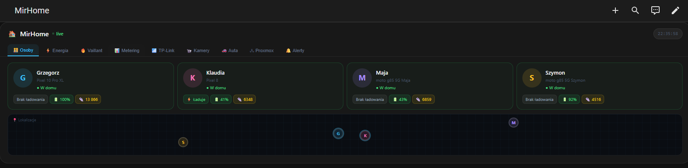

# Home Dashboard Card

[](https://github.com/keysim86/ha-home-dashboard-card/releases/latest)
[](https://github.com/keysim86/ha-home-dashboard-card)
[](https://www.home-assistant.io/)
[](LICENSE)

Kompletny, ciemny dashboard dla Home Assistant w stylu glassmorphism. Jedna karta z zakładkami — wszystko w jednym miejscu.



## Zakładki

| Zakładka | Zawartość |
|----------|-----------|
| 🏠 **Home** | Lokalizacja, bateria, kroki, mapa `ha-map` z GPS, bramy/garaże z kontrolą, wskaźnikiem światła i live timerem czasu otwarcia, widget skrzynki pocztowej z poziomem baterii, harmonogram odpadów komunalnych z badge |
| ⚡ **Energia** | Moc całkowita live, napięcia L1/L2/L3, taryfy G13s (dziennie/miesięcznie), top odbiorniki |
| 🔥 **Vaillant** | Termostaty CO + CWU ze sterowaniem (tryby, presety), wykresy temperatur 24h, wykresy zużycia gazu 30-dniowe i 12-miesięczne, ustawienia `input_number` |
| 📊 **Metering** | Tauron AMIplus (szczyt/poza/noc), myORLEN gaz, licznik wody, EcoWater, zmywarka Haier hOn |
| 📶 **TP-Link** | Omada AP/SW porty PoE, odkurzacz Zosia, aktualizacje firmware, drukarka HP |
| 📹 **Kamery** | Grid HIKVISION NVR, focus view (max-height 600px), status dysku, live refresh co 10s |
| 🚗 **Auta** | Paliwo + litry, zasięg, przebieg, bateria 12V, blokada (klikalna lock/unlock), status połączenia, lokalizacja GPS, mapa `ha-map` |
| 🖧 **Proxmox** | Node stats (CPU, RAM%, wolna RAM w GB, Disk), LXC kontenery z CPU/RAM, QEMU maszyny wirtualne |
| 🔔 **Alerty** | Reguły definiowane w YAML, badge z licznikiem na zakładce |
| 💡 **Przełączniki** | Grupy kafelków `switch`/`light`/`fan` z live statusem; klik przełącza stan |
| 🌡️ **Komfort** | Karty pomieszczeń z sensorami (temp, wilgotność, ciśnienie, nasłonecznienie, CO₂, AQI, PM2.5, PM10, VOC); kolory wartości wg norm; sterowanie humidifier (toggle + docelowa wilgotność) |

## Instalacja przez HACS

### Metoda 1 — HACS Custom Repository (zalecana)

1. Otwórz HACS → **Frontend**
2. Kliknij ⋮ → **Custom repositories**
3. Wpisz: `keysim86/ha-home-dashboard-card`
4. Kategoria: **Lovelace**
5. Kliknij **Add** → znajdź **Home Dashboard Card** → **Install**
6. Przeładuj przeglądarkę

### Metoda 2 — ręczna

1. Pobierz `home-dashboard-card.js` z [Releases](https://github.com/keysim86/ha-home-dashboard-card/releases/latest)
2. Skopiuj do `/config/www/home-dashboard-card.js`
3. Dodaj resource:

```yaml
resources:
  - url: /local/home-dashboard-card.js
    type: module
```

## Konfiguracja YAML

```yaml
type: custom:home-dashboard-card
title: MirHome

# Kolejność i widoczność zakładek (opcjonalne — domyślnie wszystkie)
tabs:
  - osoby
  - energia
  - vaillant
  - metering
  - tplink
  - kamery
  - auta
  - proxmox
  - alerty

persons:
  - name: Grzegorz
    entity: person.grzegorz
    color: "#38bdf8"
    device_tracker: device_tracker.pixel_10_pro_xl
    battery_level: sensor.pixel_10_pro_xl_battery_level
    battery_state: sensor.pixel_10_pro_xl_battery_state
    steps: sensor.pixel_10_pro_xl_daily_steps

energy:
  total_power: sensor.miresphome05_calkowita_moc_czynna
  voltage_l1: sensor.miresphome05_napiecie_fazowe_l1
  voltage_l2: sensor.miresphome05_napiecie_fazowe_l2
  voltage_l3: sensor.miresphome05_napiecie_fazowe_l3
  power_l1: sensor.miresphome05_moc_czynna_fazowa_l1
  power_l2: sensor.miresphome05_moc_czynna_fazowa_l2
  power_l3: sensor.miresphome05_moc_czynna_fazowa_l3
  daily_kwh: sensor.suma_zuzycia_dziennego_g13s
  monthly_kwh: sensor.miesieczne_zuzycie_energii_kalendarzowe_zaokr
  # Podział na taryfy G13s (opcjonalne)
  tariffs:
    szczytowa_daily: sensor.zuzycie_dzienne_g13s_dzienna_szczytowa_zaokr
    pozaszczytowa_daily: sensor.zuzycie_dzienne_g13s_dzienna_pozaszczytowa_zaokr
    nocna_daily: sensor.zuzycie_dzienne_g13s_nocna_zaokr
    szczytowa_monthly: sensor.zuzycie_miesieczne_g13s_szczytowa
    pozaszczytowa_monthly: sensor.zuzycie_miesieczne_g13s_pozaszczytowa
    nocna_monthly: sensor.zuzycie_miesieczne_g13s_nocna
  consumers:
    - name: Osuszacz Sypialnia
      entity: sensor.osuszacz_sypialnia_power
      max_w: 500
    - name: TV Salon
      entity: sensor.miresphome11_watt
      max_w: 500

vaillant:
  climate_co: climate.ogrzewanie
  climate_cwu: climate.ciepla_woda
  # Opcjonalne: input_number jako alternatywa gdy encja climate nie obsługuje set_temperature
  co_temp_input: input_number.temperatura_co
  temp_supply: sensor.ogrzewanie_temperatura_zasilania
  temp_return: sensor.ogrzewanie_temperatura_powrotu
  temp_target_supply: sensor.ogrzewanie_docelowa_temperatura_zasilania
  temp_outdoor: sensor.ogrzewanie_temperatura_zewnetrzna
  temp_outdoor_avg: sensor.temperatura_zewnetrzna_srednia
  flame: binary_sensor.ogrzewanie_plomien
  power: sensor.ogrzewanie_aktualna_moc
  fan_speed: sensor.ogrzewanie_predkosc_wentylatora
  pump: binary_sensor.ogrzewanie_pompa_wody
  pressure: sensor.ogrzewanie_cisnienie
  heat_curve: sensor.ogrzewanie_krzywa_grzewcza
  cwu_current: sensor.ciepla_woda_aktualnie
  cwu_target: sensor.ciepla_woda_docelowo
  # Wykresy zużycia gazu (30 dni + 12 miesięcy)
  gas_heating: sensor.my_home_device_gas_heating
  gas_cwu: sensor.my_home_device_gas_cwu
  el_co: sensor.my_home_device_0_vc_20cs_1_5_n_pl_ecotec_plus_consumed_electrical_energy_heating_2
  el_cwu: sensor.my_home_device_0_vc_20cs_1_5_n_pl_ecotec_plus_consumed_electrical_energy_domestic_hot_water_2
  # Ustawienia input_number (edycja przyciskami +/−)
  settings:
    - entity: input_number.krzywa_grzewcza
      name: Krzywa grzewcza
    - entity: input_number.temperatura_co_min
      name: Min. temp. CO
      decimals: 1

metering:
  tauron_daily: sensor.suma_zuzycia_dziennego_g13s
  tauron_daily_peak: sensor.zuzycie_dzienne_g13s_dzienna_szczytowa_zaokr
  tauron_daily_offpeak: sensor.zuzycie_dzienne_g13s_dzienna_pozaszczytowa_zaokr
  tauron_daily_night: sensor.zuzycie_dzienne_g13s_nocna_zaokr
  tauron_monthly: sensor.miesieczne_zuzycie_energii_kalendarzowe_zaokr
  tauron_price: sensor.tauron_aktualna_cena_g13s
  orlen_meter: sensor.myorlen_gas_sensor_8018590365500075144345_6067986
  orlen_invoice: sensor.myorlen_gas_invoice_sensor_8018590365500075144345_6067986
  orlen_cost: sensor.myorlen_gas_cost_tracking_sensor_8018590365500075144345_6067986
  water_meter: sensor.miresphome04_licznik_wody
  water_quarterly: sensor.licznik_wody_kwartalnie
  ecowater_salt: sensor.ecowater_ac000w007136026_salt_level_percentage
  ecowater_days_salt: sensor.ecowater_ac000w007136026_days_until_out_of_salt
  ecowater_flow: sensor.ecowater_ac000w007136026_water_flow
  ecowater_today: sensor.ecowater_ac000w007136026_water_used_today
  ecowater_days_regen: sensor.ecowater_ac000w007136026_days_since_last_recharge
  ecowater_rock: sensor.ecowater_ac000w007136026_rock_removed
  dishwasher_door: binary_sensor.zmywarka_door_status
  dishwasher_salt: binary_sensor.zmywarka_salt
  dishwasher_rinse: binary_sensor.zmywarka_rinse_aid
  dishwasher_water: sensor.zmywarka_current_water_used
  dishwasher_energy: sensor.zmywarka_current_electricity_used
  dishwasher_remaining: sensor.zmywarka_remaining_time
  dishwasher_program: sensor.zmywarka_program_phase

tplink:
  vacuum: vacuum.zosia
  vacuum_battery: sensor.zosia_bateria
  vacuum_area: sensor.zosia_cleaning_area
  vacuum_time: sensor.zosia_cleaning_time
  vacuum_signal: sensor.zosia_poziom_sygnalu
  vacuum_error: sensor.zosia_error
  updates:
    - entity: update.mir_ap01_firmware
      name: MIR-AP01
    - entity: update.mir_sw01_firmware
      name: MIR-SW01
  router_ports:
    - entity: binary_sensor.mir_r01_port_1_lan_status
      label: "1"
    - entity: binary_sensor.mir_r01_port_2_internet_link
      label: "WAN"
  sw01_ports:
    - entity: switch.mir_sw01_port_1_poe
      label: "1"
  printer_status: sensor.hp_officejet_pro_8020_series_mir_p002_local_status
  ink_black: sensor.hp_officejet_pro_8020_series_mir_p002_local_black_ink_poziom
  ink_cyan: sensor.hp_officejet_pro_8020_series_mir_p002_local_cyan_ink_poziom
  ink_magenta: sensor.hp_officejet_pro_8020_series_mir_p002_local_magenta_ink_poziom
  ink_yellow: sensor.hp_officejet_pro_8020_series_mir_p002_local_yellow_ink_poziom

cameras:
  nvr_disk_total_gb: 4000
  nvr_disk_used_gb: 2800
  channels:
    - name: Brama wjazdowa
      entity: camera.ds_7608nxi_k20820221219ccrrl07078026wcvu_101
      label: CH1
    - name: Wjazd garaże
      entity: camera.ds_7608nxi_k20820221219ccrrl07078026wcvu_201
      label: CH2

vehicles:
  - name: KIA Sportage
    icon: "🚙"
    plate: KKR 4F384
    fuel_level: sensor.sportage_fuel_level
    fuel_range: sensor.sportage_fuel_driving_range
    odometer: sensor.sportage_odometer
    battery: sensor.sportage_car_battery_level      # bateria 12V (opcjonalne)
    lock: lock.sportage_door_lock
    connection: binary_sensor.sportage_connection   # Online/Offline (opcjonalne)
    location: device_tracker.sportage_location      # GPS — mapa + lokalizacja
    last_update: sensor.sportage_last_updated_at
  - name: Renault Captur
    icon: "🚗"
    plate: KKR XXXXX
    fuel_level: sensor.captur_fuel_level
    fuel_range: sensor.captur_fuel_range
    odometer: sensor.captur_odometer
    location: device_tracker.captur_location
    last_update: sensor.captur_last_update

proxmox:
  node_cpu: sensor.node_pve2_cpu_used
  node_ram_pct: sensor.node_pve2_memory_used_percentage
  node_ram_free: sensor.node_pve2_memory_free
  node_disk_pct: sensor.node_pve2_disk_used_percentage
  node_lxc_running: sensor.node_pve2_containers_running
  node_vm_running: sensor.node_pve2_virtual_machines_running
  lxc:
    - id: 100
      name: mir-pbs
      info: Proxmox Backup
      cpu: sensor.lxc_mir_pbs_100_cpu_used
      ram: sensor.lxc_mir_pbs_100_memory_used_percentage
      status: binary_sensor.lxc_mir_pbs_100_status
  vms:
    - id: 200
      name: mirhome
      info: Home Assistant OS
      cpu: sensor.qemu_mirhome_200_cpu_used
      ram: sensor.qemu_mirhome_200_memory_used_percentage
      status: binary_sensor.qemu_mirhome_200_status

waste:
  sensors:
    - entity: sensor.odpady_zmieszane
      name: Zmieszane
      icon: "🗑️"
    - entity: sensor.odpady_plastik
      name: Plastik/Metal
      icon: "♻️"
    - entity: sensor.odpady_papier
      name: Papier
      icon: "📰"
    - entity: sensor.odpady_szklo
      name: Szkło
      icon: "🫙"
    - entity: sensor.odpady_gabaryty
      name: Gabaryty
      icon: "📦"
    - entity: sensor.odpady_tekstylia
      name: Tekstylia
      icon: "👕"
    - entity: sensor.odpady_elektronika
      name: Elektronika
      icon: "📺"
    - entity: sensor.odpady_bio
      name: Biodegradowalne
      icon: "🌿"
      toggle: input_boolean.odpady_bio_aktywne  # opcjonalne — ukrywa frakcję gdy off

gates:
  - entity: cover.brama_wjazdowa
    name: Brama
    icon: "🚗"
  - entity: cover.garaz_1
    name: Garaż 1
    icon: "🏠"
    light: light.garaz_1       # opcjonalne — wskaźnik światła na kafelku
  - entity: cover.garaz_2
    name: Garaż 2
    icon: "🏠"
    light: light.garaz_2
  - entity: cover.bramka
    name: Bramka
    icon: "🚶"

mailbox:
  entity: sensor.skrzynka_pocztowa           # on = jest poczta, off = pusta
  battery: sensor.supla_skrzynka_poziom_baterii_w_skrzynce_pocztowej  # opcjonalne, w %
  name: Skrzynka pocztowa                    # opcjonalne

switches:
  groups:
    - name: Gniazdka
      icon: "🔌"
      entities:
        - entity: switch.gniazdko_salon
          name: Salon
        - entity: switch.gniazdko_kuchnia
          name: Kuchnia
    - name: Światło
      icon: "💡"
      entities:
        - entity: light.salon
          name: Salon
        - entity: light.sypialnia
          name: Sypialnia
          icon: "🛏️"    # opcjonalne — nadpisuje domyślną ikonę
    - name: Inne
      icon: "⚙️"
      entities:
        - entity: fan.wentylator
          name: Wentylator

comfort:
  rooms:
    - name: Na zewnątrz
      icon: "🌤️"
      temperature: sensor.nettigo_air_monitor_bme280_temperatura
      humidity: sensor.nettigo_air_monitor_bme280_wilgotnosc
      pressure: sensor.nettigo_air_monitor_bme280_cisnienie
      illuminance: sensor.nettigo_air_monitor_bh1750_natezenie_oswietlenia
      co2: sensor.salon_co2
      aqi: sensor.nettigo_air_monitor_sds011_poziom_caqi
      pm25: sensor.nettigo_air_monitor_sds011_pm25
      pm10: sensor.nettigo_air_monitor_sds011_pm10
      voc: sensor.czujnik_salon_voc
    - name: Salon
      icon: "🛋️"
      temperature: sensor.czujnik_salon_temperature
      humidity: sensor.czujnik_salon_humidity
      battery: sensor.czujnik_salon_battery
      illuminance: sensor.salon_lux
      voc: sensor.czujnik_salon_voc
    - name: Sypialnia
      icon: "🛏️"
      temperature: sensor.czujnik_sypialnia_temperature
      humidity: sensor.czujnik_sypialnia_humidity
      pressure: sensor.salon_pressure
      battery: sensor.czujnik_sypialnia_battery
      humidifier: humidifier.osuszacz_sypialnia
    - name: Pokój dzieci
      icon: "🧒"
      temperature: sensor.czujnik_pokoj_dzieci_temperature
      humidity: sensor.czujnik_pokoj_dzieci_humidity
      battery: sensor.czujnik_pokoj_dzieci_battery
      humidifier: humidifier.osuszacz_pokoj_dzieci
    - name: Łazienka
      icon: "🚿"
      temperature: sensor.czujnik_lazienka_temperature
      humidity: sensor.czujnik_lazienka_humidity
      battery: sensor.czujnik_lazienka_battery
      humidifier: humidifier.osuszacz_pokoj_dzieci
    - name: Suszarnia
      icon: "🧺"
      temperature: sensor.czujnik_suszarnia_temperature
      humidity: sensor.czujnik_suszarnia_humidity
      battery: sensor.czujnik_suszarnia_battery
    # Wszystkie pola oprócz name są opcjonalne — nieużywane nie pojawią się na karcie
    # Dostępne pola: temperature, humidity, pressure, illuminance, co2, aqi, pm25, pm10, voc, battery, humidifier

alerts:
  - entity: sensor.pixel_8_battery_level
    condition: "< 20"
    message: "Klaudia — bateria krytyczna"
    severity: error
  - entity: cover.miresphome01_brama_wjazdowa_glowna
    condition: "== open"
    message: "Brama wjazdowa otwarta"
    severity: warn
  - entity: sensor.ogrzewanie_cisnienie
    condition: "< 1.0"
    message: "Ciśnienie CO za niskie"
    severity: error
  - entity: sensor.ecowater_ac000w007136026_days_until_out_of_salt
    condition: "< 14"
    message: "EcoWater — uzupełnij sól"
    severity: warn
```

## Wymagania

- Home Assistant 2024.1.0+
- HACS 1.34.0+

## Licencja

MIT — szczegóły w pliku [LICENSE](LICENSE).
